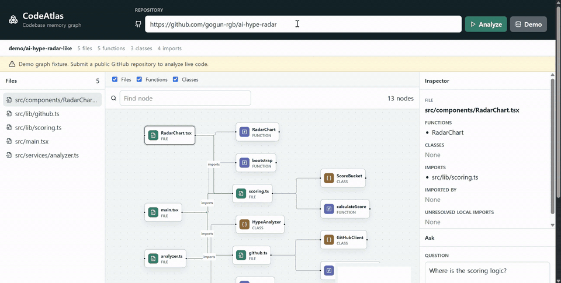
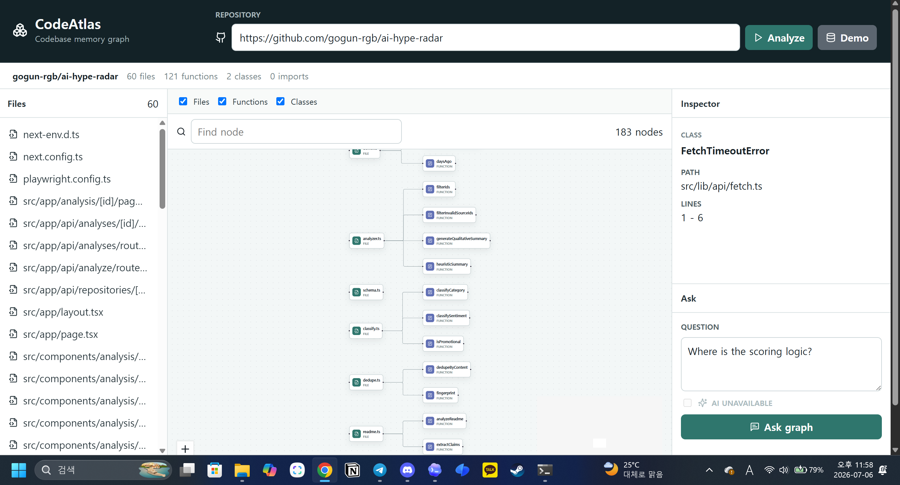
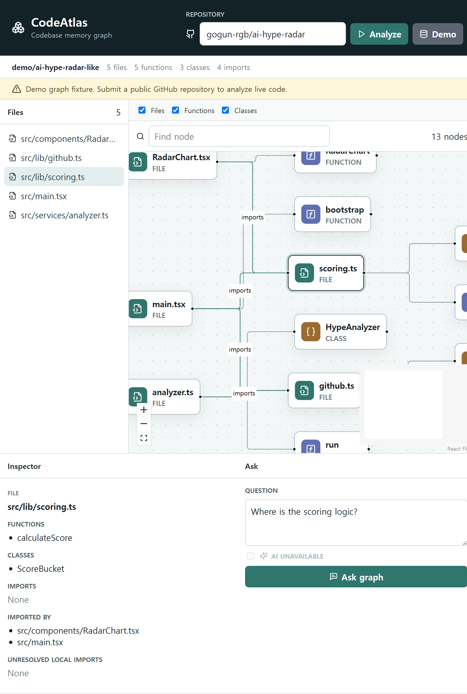
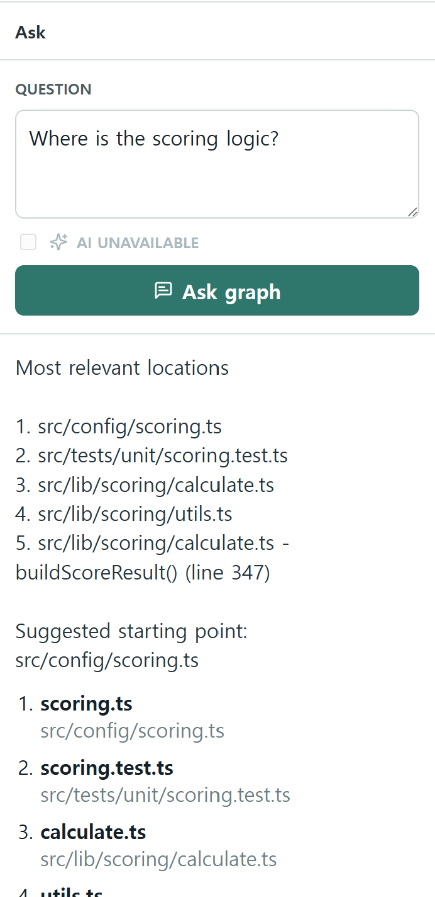
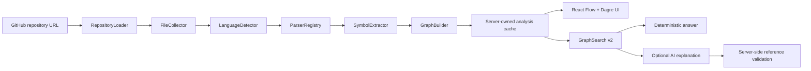

## Live Demo

https://codeatlas-s16g.onrender.com

# CodeAtlas

> You open a repository you haven't touched in three weeks.
>
> You remember what the project does.
>
> You don't remember where anything is.
>
> CodeAtlas builds a memory map of the codebase.

CodeAtlas is a graph-first codebase onboarding tool. It accepts a public GitHub repository, performs static analysis, and renders an interactive map of files, symbols, imports, and containment relationships.

Understand a codebase before touching it.

<p align="center">
  
</p>

## What It Does

CodeAtlas turns public repository source into a deterministic graph:

- Loads a public GitHub repository.
- Fetches supported GitHub blobs with bounded concurrency while preserving deterministic file ordering and source-size limits.
- Filters generated, dependency, oversized, binary, and unsupported files.
- Parses TypeScript, TSX, JavaScript, JSX, and Python.
- Extracts files, functions, classes, exports, local imports, external imports, parser warnings, and reverse-import metadata.
- Builds `FILE`, `FUNCTION`, `CLASS`, `IMPORTS`, and `CONTAINS` graph relationships deterministically.
- Stores completed analysis graphs behind opaque server-owned analysis IDs in a bounded in-memory TTL cache.
- Answers onboarding questions with deterministic GraphSearch v2 before optional supplementary AI explanation.

Graph-first retrieval is the core product principle: CodeAtlas ranks known graph nodes instead of sending an entire repository to an LLM.

## Live Repository Analysis

CodeAtlas was manually tested against the public repository [`gogun-rgb/ai-hype-radar`](https://github.com/gogun-rgb/ai-hype-radar).

Observed live analysis snapshot:

- 60 files
- 121 functions
- 2 classes
- 183 graph nodes

<p align="center">
  
</p>

The screenshot shows `0 imports` for this repository because it uses TypeScript `@/*` path aliases. Absolute import alias resolution is intentionally outside the current MVP scope.

## Graph Visualization

The demo fixture is deterministic and intentionally small, which makes graph relationships easy to inspect.

<p align="center">
  
</p>

The MVP graph model includes:

- `FILE`: supported source files
- `FUNCTION`: parsed top-level functions, function expressions, and class methods where supported
- `CLASS`: parsed classes
- `IMPORTS`: resolved local relative imports between known repository files
- `CONTAINS`: file-to-symbol relationships

The model leaves room for future `CALLS`, `REFERENCES`, `IMPLEMENTS`, and `EXTENDS` edges, but the MVP does not claim full call resolution.

## Graph-First Questions

Questions are answered by deterministic graph search. The frontend keeps the graph for visualization, but question answering uses the server-owned analysis graph referenced by `analysis_id`; the client does not send an authoritative graph payload back to `/api/question`.

1. Normalize the user question, including camelCase, PascalCase, snake_case, kebab-case, and path segment tokenization.
2. Apply a small deterministic concept map for common onboarding terms such as auth, config, database, API, and GitHub.
3. Retrieve lexical seed candidates from paths, symbol names, exports, imports, external imports, unresolved imports, and reverse-import metadata.
4. Expand bounded graph neighborhoods over `IMPORTS` and `CONTAINS` edges up to two hops.
5. Rerank with deterministic structural evidence while preventing generic high-degree files from dominating.
6. Return ranked candidate nodes and a suggested starting point.
7. Optionally ask AI to explain only the retrieved graph context.
8. Post-validate every structured AI file and symbol reference on the server. If validation fails, the AI explanation is discarded and the deterministic result remains visible.

<p align="center">
  
</p>

For the live `ai-hype-radar` graph, the question "Where is the scoring logic?" ranked `src/config/scoring.ts` as the suggested starting point, followed by related scoring tests and calculation utilities.

The application remains fully useful without an OpenAI API key. Optional AI explanation is shown below the deterministic graph result and is not source-of-truth graph data.

## Architecture



Backend responsibilities are split across repository loading, filtering, language detection, parsing, graph building, search, and optional AI explanation. The frontend uses React, TypeScript, React Flow, and Dagre for the graph workspace.

## Static Analysis Boundary

Repository code is never executed. CodeAtlas does not:

- run target package scripts
- install target repository dependencies
- execute target Python files
- shell into analyzed repositories
- treat repository content as trusted input

The analyzer ignores binary files and common generated or dependency directories such as `.git`, `node_modules`, `.next`, `dist`, `build`, `coverage`, `vendor`, and `generated`.

## Supported MVP Languages

- TypeScript
- TSX
- JavaScript
- JSX
- Python

The MVP resolves deterministic local relative imports for JavaScript, TypeScript, and Python. External package imports are recorded as metadata, not invented as internal file nodes.

## Verification

Run the normal verification workflow:

```bash
pnpm run verify
```

This runs:

- backend Ruff linting
- backend mypy type checking
- backend pytest
- frontend ESLint
- frontend TypeScript checking
- Vite production build
- frontend Vitest

Current local verification snapshot:

- backend pytest: 74 passed, 1 warning
- frontend Vitest: 5 files / 16 tests passed
- GitHub Actions `Verify`: configured to run the same workflow on push and pull request, but remote CI must be checked against the exact pushed commit before claiming a remote pass

See the [validation and cross-check record](docs/validation.md) for implementation review history and defect-reproduction evidence.

## Local Setup

Backend dependencies are declared in `backend/pyproject.toml`. CI uses the committed `backend/uv.lock` for reproducible backend dependency resolution.

Install backend dependencies with pip for the simplest local setup:

```bash
python -m pip install -e "backend[dev]"
```

For a CI-equivalent backend install, use the locked `uv` workflow:

```bash
uv sync --project backend --extra dev --frozen
```

CI points `CODEATLAS_PYTHON` at the `backend/.venv` interpreter created by `uv`. The pip setup above remains the simplest local path for `pnpm run verify`.

Install frontend dependencies:

```bash
pnpm install
```

Optional local environment:

```bash
GITHUB_TOKEN=
OPENAI_API_KEY=
CODEATLAS_ALLOWED_ORIGINS=
CODEATLAS_ANALYZE_RATE_LIMIT=10
CODEATLAS_ANALYZE_RATE_WINDOW_SECONDS=600
CODEATLAS_QUESTION_QUOTA=50
CODEATLAS_AI_QUOTA=10
CODEATLAS_LIMITER_MAX_TRACKED_ANALYSES=256
CODEATLAS_TRUST_X_FORWARDED_FOR=false
```

`GITHUB_TOKEN` is optional. Public repositories still work without it, but unauthenticated GitHub API rate limits are lower. Setting it for the backend gives local analysis and portfolio demos more GitHub API rate-limit headroom. Private repository support is not claimed.

`OPENAI_API_KEY` is optional. Deterministic graph-first answers work without AI; the key only enables optional explanation of already retrieved graph context.

Public API abuse boundaries are intentionally in-process for the MVP. Defaults allow 10 `/api/analyze` requests per client key per 10 minutes, 50 questions per `analysis_id`, and 10 optional AI explanation requests per `analysis_id`. When the AI quota is exhausted, CodeAtlas returns the deterministic graph answer with `ai_status` set to `quota_exhausted` and does not call OpenAI.

The analyze limiter uses the direct ASGI client address by default. `CODEATLAS_TRUST_X_FORWARDED_FOR=true` explicitly switches client identity to the first non-empty `X-Forwarded-For` value for trusted proxy deployments; leave it disabled unless the deployment boundary is trusted.

Run the app:

```bash
pnpm run dev
```

The backend runs through FastAPI/Uvicorn and the frontend runs through Vite.

## Render Deployment

CodeAtlas can be deployed as two Render services: one Web Service for the FastAPI backend and one Static Site for the Vite frontend.

Backend Web Service:

Build Command:

```bash
pip install -e backend
```

Start Command:

```bash
uvicorn app.main:app --app-dir backend --host 0.0.0.0 --port $PORT
```

Health Check Path:

```text
/api/health
```

Backend environment variables:

- `CODEATLAS_ALLOWED_ORIGINS`
- `GITHUB_TOKEN` optional
- `OPENAI_API_KEY` optional
- `CODEATLAS_ANALYZE_RATE_LIMIT` optional
- `CODEATLAS_ANALYZE_RATE_WINDOW_SECONDS` optional
- `CODEATLAS_QUESTION_QUOTA` optional
- `CODEATLAS_AI_QUOTA` optional
- `CODEATLAS_LIMITER_MAX_TRACKED_ANALYSES` optional
- `CODEATLAS_TRUST_X_FORWARDED_FOR` optional

Frontend Static Site:

Build Command:

```bash
pnpm install --frozen-lockfile && pnpm --dir frontend run build
```

Publish Directory:

```text
frontend/dist
```

Frontend environment variable:

- `VITE_API_BASE_URL`

## Limitations

- Public GitHub repositories only.
- GitHub API rate limits may apply.
- Large repositories are limited by file count and total source size.
- Server-side analysis IDs use a process-local in-memory TTL cache, not persistent storage.
- GraphSearch v2 is deterministic graph retrieval, not arbitrary semantic code comprehension.
- Deterministic concept expansion is intentionally small and explicit.
- Full `CALLS` resolution is not implemented.
- Absolute import alias resolution is not included.
- Complete ECMAScript module alias resolution is not included.
- Parser warnings may indicate incomplete graph data.
- Optional AI explanation is supplementary and is discarded when structured references fail validation.

## Roadmap

- Add call/reference analysis where language support is strong enough.
- Add persistent repository caching.
- Add snippet retrieval for selected candidates with strict size caps.
- Add graph clustering for large projects.
