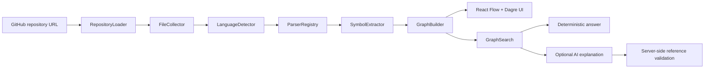

# CodeAtlas

> You open a repository you haven't touched in three weeks.
>
> You remember what the project does.
>
> You don't remember where anything is.
>
> CodeAtlas builds a memory map of the codebase.

CodeAtlas is a graph-first codebase onboarding tool. It accepts a public GitHub repository, performs static analysis, and renders an interactive map of files, symbols, imports, and containment relationships.

Understand a codebase before touching it.

<p align="center">
  
</p>

## What It Does

CodeAtlas turns public repository source into a deterministic graph:

- Loads a public GitHub repository.
- Filters generated, dependency, oversized, binary, and unsupported files.
- Parses TypeScript, TSX, JavaScript, JSX, and Python.
- Extracts files, functions, classes, exports, local imports, external imports, parser warnings, and reverse-import metadata.
- Builds `FILE`, `FUNCTION`, `CLASS`, `IMPORTS`, and `CONTAINS` graph relationships.
- Answers onboarding questions with deterministic graph search before optional AI explanation.

Graph-first retrieval is the core product principle: CodeAtlas ranks known graph nodes instead of sending an entire repository to an LLM.

## Live Repository Analysis

CodeAtlas was manually tested against the public repository [`gogun-rgb/ai-hype-radar`](https://github.com/gogun-rgb/ai-hype-radar).

Observed live analysis snapshot:

- 60 files
- 121 functions
- 2 classes
- 183 graph nodes

<p align="center">
  
</p>

The screenshot shows `0 imports` for this repository because it uses TypeScript `@/*` path aliases. Absolute import alias resolution is intentionally outside the current MVP scope.

## Graph Visualization

The demo fixture is deterministic and intentionally small, which makes graph relationships easy to inspect.

<p align="center">
  
</p>

The MVP graph model includes:

- `FILE`: supported source files
- `FUNCTION`: parsed top-level functions, function expressions, and class methods where supported
- `CLASS`: parsed classes
- `IMPORTS`: resolved local relative imports between known repository files
- `CONTAINS`: file-to-symbol relationships

The model leaves room for future `CALLS`, `REFERENCES`, `IMPLEMENTS`, and `EXTENDS` edges, but the MVP does not claim full call resolution.

## Graph-First Questions

Questions are answered by deterministic graph search:

1. Normalize the user question.
2. Search graph nodes by path, symbol name, imports, exports, and reverse-import metadata.
3. Return ranked candidate nodes and a suggested starting point.
4. Optionally ask AI to explain only the retrieved graph context.
5. Post-validate every AI file and symbol reference on the server.

<p align="center">
  
</p>

For the live `ai-hype-radar` graph, the question "Where is the scoring logic?" ranked `src/config/scoring.ts` as the suggested starting point, followed by related scoring tests and calculation utilities.

The application remains fully useful without an OpenAI API key. Optional AI explanation is isolated from deterministic graph generation and is not source-of-truth graph data.

## Architecture



Backend responsibilities are split across repository loading, filtering, language detection, parsing, graph building, search, and optional AI explanation. The frontend uses React, TypeScript, React Flow, and Dagre for the graph workspace.

## Static Analysis Boundary

Repository code is never executed. CodeAtlas does not:

- run target package scripts
- install target repository dependencies
- execute target Python files
- shell into analyzed repositories
- treat repository content as trusted input

The analyzer ignores binary files and common generated or dependency directories such as `.git`, `node_modules`, `.next`, `dist`, `build`, `coverage`, `vendor`, and `generated`.

## Supported MVP Languages

- TypeScript
- TSX
- JavaScript
- JSX
- Python

The MVP resolves deterministic local relative imports for JavaScript, TypeScript, and Python. External package imports are recorded as metadata, not invented as internal file nodes.

## Verification

Run the normal verification workflow:

```bash
pnpm run verify
```

This runs:

- backend Ruff linting
- backend mypy type checking
- backend pytest
- frontend ESLint
- frontend TypeScript checking
- Vite production build
- frontend Vitest

Current verified packaging snapshot:

- backend pytest: 23 passed
- frontend Vitest: 2 files / 4 tests passed
- GitHub Actions `Verify`: configured to run the same workflow on push and pull request

See the [validation and cross-check record](docs/validation.md) for implementation review history and defect-reproduction evidence.

## Local Setup

Install backend dependencies:

```bash
python -m pip install -e "backend[dev]"
```

Install frontend dependencies:

```bash
pnpm install
```

Optional local environment:

```bash
GITHUB_TOKEN=
OPENAI_API_KEY=
```

`GITHUB_TOKEN` is optional. Public repositories still work without it, but unauthenticated GitHub API rate limits are lower. Setting it for the backend gives local analysis and portfolio demos more GitHub API rate-limit headroom. Private repository support is not claimed.

`OPENAI_API_KEY` is optional. Deterministic graph-first answers work without AI; the key only enables optional explanation of already retrieved graph context.

Run the app:

```bash
pnpm run dev
```

The backend runs through FastAPI/Uvicorn and the frontend runs through Vite.

## Limitations

- Public GitHub repositories only.
- GitHub API rate limits may apply.
- Large repositories are limited by file count and total source size.
- Full `CALLS` resolution is not implemented.
- Absolute import alias resolution is not included.
- Parser warnings may indicate incomplete graph data.
- Optional AI explanation is not source-of-truth graph data.

## Roadmap

- Add call/reference analysis where language support is strong enough.
- Add repository-level caching.
- Add snippet retrieval for selected candidates with strict size caps.
- Add graph clustering for large projects.
