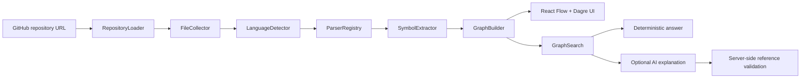

# CodeAtlas

> You open a repository you haven't touched in three weeks.
>
> You remember what the project does.
>
> You don't remember where anything is.
>
> CodeAtlas builds a memory map of the codebase.

CodeAtlas is a portfolio-quality developer tool for codebase onboarding. It accepts a public GitHub repository, performs static analysis, and renders an interactive graph of files, functions, classes, imports, and containment relationships.

The product idea is simple: understand a codebase before touching it.

## What It Solves

Beginner developers often need to answer practical questions before making a change:

- Where is the scoring logic?
- Where should authentication change?
- Which files depend on this file?
- Where does GitHub data enter the application?

CodeAtlas treats those questions as graph retrieval problems first. It builds a deterministic code graph, searches that graph locally, and returns ranked starting points. Optional AI explanation is isolated behind a small service, and it can only explain retrieved graph context.

## Architecture



Backend responsibilities are separated into loader, filtering, language detection, parser registry, symbol extraction, graph building, graph search, and optional AI explanation. The frontend uses React, TypeScript, React Flow, and Dagre for a responsive graph workspace.

## Static Analysis Boundary

Repository code is never executed. CodeAtlas does not run package scripts, install target repository dependencies, execute Python files, or shell into analyzed repositories. GitHub content is treated as untrusted input.

The analyzer ignores binary files and common generated or dependency directories such as `.git`, `node_modules`, `.next`, `dist`, `build`, `coverage`, `vendor`, and `generated`.

## Supported MVP Languages

- TypeScript
- TSX
- JavaScript
- JSX
- Python

The MVP extracts files, functions, classes, imports, and exports where straightforward. It resolves deterministic local relative imports for JavaScript, TypeScript, and Python. External package imports are recorded as metadata, not fake internal file nodes.

## Graph Model

The graph uses explicit typed nodes and edges:

- `FILE`
- `FUNCTION`
- `CLASS`
- `IMPORTS`
- `CONTAINS`

The model leaves room for future `CALLS`, `REFERENCES`, `IMPLEMENTS`, and `EXTENDS` edges, but the MVP does not pretend syntax-level name matching is a reliable call graph.

Node and edge IDs are deterministic for identical source input.

## Graph-First Questions

CodeAtlas uses graph-first context retrieval instead of sending the entire repository to an LLM.

Question workflow:

1. Normalize the user question.
2. Search graph nodes by file path, symbol name, imports, exports, and reverse imports.
3. Return ranked candidate nodes and a deterministic answer.
4. If AI is available, explain only the retrieved candidate context.
5. Validate every AI reference against known graph paths and symbols.

The app remains fully useful without an OpenAI API key. When `OPENAI_API_KEY` is unavailable, the question feature returns deterministic ranked results.

## Demo Mode

The local demo mode works without GitHub or OpenAI credentials. It loads a deterministic TypeScript-flavored sample graph with GitHub ingestion, scoring, analysis, and chart files.

Recommended real-world demo repository:

```text
https://github.com/gogun-rgb/ai-hype-radar
```

CodeAtlas does not hardcode claims about that repository. It analyzes the live repository when submitted.

## Local Setup

Install backend dependencies:

```bash
python -m pip install -e "backend[dev]"
```

Install frontend dependencies:

```bash
pnpm install
```

Optional local environment:

```bash
GITHUB_TOKEN=
OPENAI_API_KEY=
```

CodeAtlas can analyze public GitHub repositories without a `GITHUB_TOKEN`, but unauthenticated GitHub API rate limits are lower. Setting `GITHUB_TOKEN` for the backend gives local analysis and portfolio demos more GitHub API rate-limit headroom. It is optional and does not change the public-repository-only MVP scope.

Run the app:

```bash
pnpm run dev
```

The backend runs through FastAPI/Uvicorn and the frontend runs through Vite.

## Verification

Run the normal verification workflow:

```bash
pnpm run verify
```

This runs backend linting, backend type checking, backend tests, frontend linting, frontend type checking, frontend tests, and a production build.

## Limitations

- Public GitHub repositories only.
- GitHub API rate limits may apply.
- Very large repositories are limited by file count and total source size.
- The MVP does not implement full call resolution.
- Absolute import alias resolution is not included.
- Parser errors are surfaced as safe file warnings and metadata instead of raw stack traces.
- Optional AI explanation is not source-of-truth graph data.

## Roadmap

- Add call/reference analysis where language support is strong enough.
- Add Go, Rust, and Java extractors.
- Add repository-level caching.
- Add snippet retrieval for selected candidates with strict size caps.
- Add graph clustering for large projects.
- Add richer onboarding workflows around common beginner tasks.
